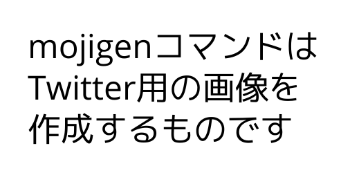

# mojigen



## mojigenとは？

文字からTwitterサイズの画像を生成するコマンドです。

##　使い方

### インストール

```sh
GO111MODULE=off go get github.com/aimof/mojigen
go install github.com/aimof/mojigen/cmd/mojigen
```

### 画像生成

```sh
mojigen out.png ここにテキストを書いてください
```

* Arg[0]: mojigen
* Arg[1]: output fileのパス
* Arg[2:]: テキスト

あとは、Twitterに貼り付けるなりなんなり好きにしてください。

## 注意

* 現状、文字サイズ固定
* 改行位置はArgsで指定します。一つのArgsが一行になります。
* 全角時、一行あたり8~9文字が自然に入る文字数です。
* 高さは自動で調節されます。
* フォントはKoruriを利用していますが、git submoduleで管理しているので必ず配置してください。

## LICESNE

MIT